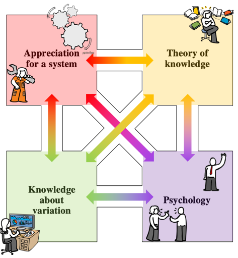

# Day 3: Taking the Red Pill—Introduction to Profound Knowledge

## "I'm Trying to Free Your Mind"

In the movie, Morpheus offers Neo a choice that will determine his future: take the **blue pill** (stay comfortable in the illusion of the real world) or the **red pill** (see the illusions for what they are and so break through them).

Dr. Deming offers us the same choice. His "red pill" is the **System of Profound Knowledge**—four interconnected lenses that allow you to see your organization as it actually is, not as conventional management theory suggests. He referred to this as the route to transformation:

>*We have grown up in a climate of competition between people, teams, departments, divisions, pupils, schools, universities. We have been taught by economists that competition will solve our problems. Actually, competition, we see now, is destructive. It would be better if everyone would work together as a system, with the aim for everybody to win. What we need is cooperation and transformation to a new style of management.*
>
>*The **route to transformation** is what I call Profound Knowledge. edge. The **System of Profound Knowledge** is composed of four parts, all related to each other.*
>
>W. Edwards Deming. *The New Economics for Industry, Government, Education* (2nd Ed. pp., 3rd Ed. pp. )

### The Four Lenses of Profound Knowledge:

1. **Appreciation for a System**
   - Organizations are systems of interdependent components, not isolated parts
   - Components (including people) work together to transform inputs into outputs
   - The quality of a system's output is the product of the interactions between its parts
   - Ergo, a system isn't improved by optimizing its parts outside of their interactions

2. **Knowledge of Variation**
   - All systems and processes vary by some amount ***normally*** and sometimes by some amount ***extraordinarily***
   - Good management depends on knowing how to distinguish one type of variation from another to limit the side-effect of unintended consequences
   - Variation in system and process data is visualized on a **Process Behaviour Chart**
   - Reacting to normal system and process variation can make things worse, as can ignoring signals extraordinary variation
     
3. **Theory of Knowledge**
   - Knowledge comes from theory, tested by experience
   - Without theory, experience teaches us nothing; worse, we can begin to confuse coincidence with cause-and-effect
   - Prediction, not explanation, tests understanding

4. **Psychology**
   - The system people work within has the predominant effect on their behaviour; change the system, change the behaviour
   - People can be motivated by outside pressure or inducements (extrinsic) or by taking pride and joy in the things they do (intrinsic)
   - Good management depends on distinguishing one type of motivation from the other
   - Extrinsic motivation (rewards, pay-for-performance, merit increases) is a form of optimizing a component apart from its interactions: it can lead people to achieve the reward without caring about the effects on the system
   - Intrinsic motivation (learning, freedom from fear, pride and joy in work) takes more effort to build and sustain, but is like capturing lightning in a bottle

**Here's the key insight:** These four bodies of knowledge are not separate disciplines. They interrelate. You cannot truly understand one without understanding the others.

- Systems thinking without knowledge of variation leads to false conclusions about cause and effect
- Understanding variation without psychology leads to blaming people for system problems
- Psychology without systems thinking leads to individual solutions for system problems
- Theory of knowledge ties it all together—helping us learn and improve over time

**You don't need to master these domains immediately.** But you need to know they exist and begin developing your understanding. As Dr. Deming said, this is the route to transformation, not a destination. By working to become better in each domain, you will open up opportunities for improving the quality of your organizations products and services.

## Reflection Questions
1. Which of the four lenses feels most foreign to your current way of thinking?
2. Which feels the most natural?
3. Can you recall a recent problem where lack of one of these lenses led to a poor decision, or where you applied thinking through them that led to a good decision?

## Today's Challenge
Pick one lens that intrigues you most. We'll explore each one in depth over the next four days. For today, just notice: 

- Where might this lens help you to see through daily phenomena differently? 
- If you can, share what you've learned in this reading with a colleague or friend. What are their thoughts?
