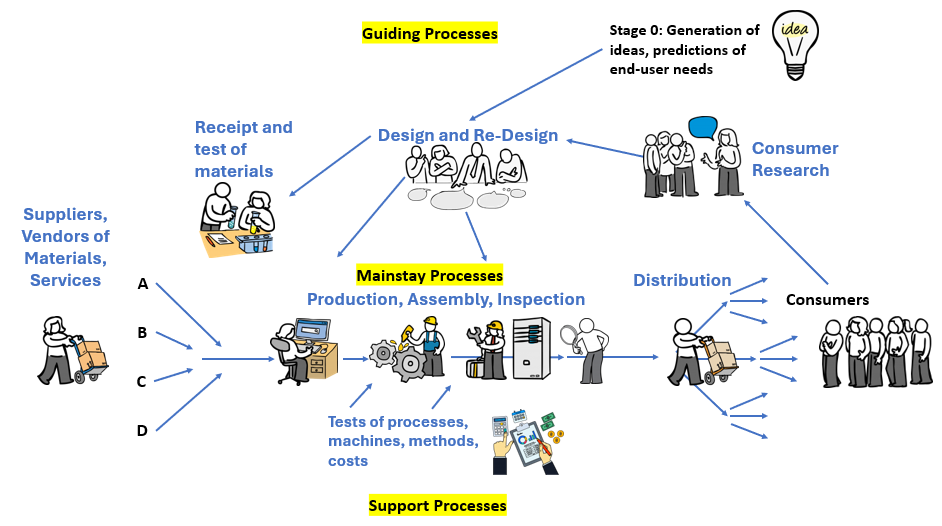

# Day 4: Lens One—Appreciation for a System

## "There Is No Spoon"

In the Matrix, while visiting a helpful program called The Oracle, Neo sees a child bending a spoon with his mind. He tells Neo: "There is no spoon... it is not the spoon that bends, it is only yourself." The child understands that the Matrix is only the illusion of reality, so to change things in it requires changing how you see and interact with the artifacts it presents.

Dr. Deming reveals a similar insight by helping us to understand how to see our organizations as a ***system.***

**What is a system?**

In The New Economics, Dr. Deming gives us his definition of a system:

> ****What is a system?*** A system is a network of interdependent components that work together to try to accomplish the aim of the system.*
> 
> ****A system must have an aim.*** Without an aim, there is no system. The aim of the system must be clear to everyone in the system. The aim must include plans for the future. The aim is a value judgment. (We are of course talking here about a man-made system.)*
> 
> W. Edwards Deming. *The New Economics for Industry, Government, Education* 2nd Ed. (pp. ), 3rd Ed. (pp. )

Key word: **interdependent**. A system cannot be understood through the components in isolation, but through how they work *together* in service of the **AIM**.

**Examples:**
- An orchestra (musicians + conductor + music + instruments + acoustics → performance) 
  - **AIM:** To please the audience with the performance.
- An automobile (engine + transmission + wheels + steering → transportation) 
  - **AIM:** To move people and goods from place to place quickly and safely.
- A hospital (doctors + nurses + facilities + processes + equipment → patient care) 
  - **AIM:** To help people heal from injury or disease, or to help new life into the world.

**Why does this matter for management?**

The **prevailing style of management** used almost everywhere assumes that people work independent of the system they are in. When things go wrong, the motivation for a manager or leader is to find the individual(s) responsible and hold them to account.

We see this with:
- **Individual** performance reviews
- **Individual** incentives
- **Individual** accountability
- **"Personal responsibility"** for outcomes
- **Divisions** in organizations, breaking them into parts

But in reality, **most variation in performance and quality comes from the way people have organized by management and not their individual efforts.**

Dr. Deming observed:

> *I should estimate that in my experience most troubles and most possibilities for improvement add up to proportions something like this : 94% belong to the system (responsibility of management) 6% special [extraordinary causes].*
> 
> *“Bill,” I asked of the manager of a company engaged in motor freight, “how much of this trouble [shortage and damage] is the fault of the drivers?” His reply, “All of it,” was a guarantee that this level of loss will continue until he learns that the main causes of trouble belong to the system, which is for Bill to work on.*
> 
> Deming, W. Edwards. _Out of the Crisis_ (The MIT Press) (p. 315). The MIT Press. Kindle Edition. 

As a result, under traditional management practices, we focus our attention on fixing people instead of the system. Dr. Deming would say that we're expending our hard work and best efforts on problems without understanding what to do, and so make our problems worse.

**What happens when you treat a system as independent parts:**
- Sales blames production for late deliveries to customers
- Production blames purchasing for poor materials that cause rework delays
- Purchasing blames finance for budget constraints that led to purchasing sub-par materials
- Everyone optimizes their part, the whole suffers
- Competition between people, teams, departments, and divisions replaces cooperation
- The customer loses

**Systems thinking changes everything:**
- Instead of "Who did this wrong?", first ask "How did our system or process cause this result?"
- Instead of "How can I maximize my department?", ask "How does my work affect others to help improve the whole?"
- Instead of setting individual targets, focus on total system capability
- Instead of fixing people, consider improving the processes and systems they work within

**The manager's job shifts:** 
- From being a manager of defects through judging and motivating people to system and process designer

## Dr. Deming's Model of a System

Pictured above is an annotated version of the same diagram Dr. Deming showed the Japanese in 1950 to jumpstart their industries' transformation. He encouraged them to see their operations as a system of interrelated and interdependent processes rather than a hierarchy of roles and departments. He called this "Production Viewed as a System", but it can be adapted to describe almost any organization. Note that Dr. Deming placed the customer in the diagram because he considered them the most important part of production.

## Reflection Questions
1. Describe your work area as a system. What are the interdependent components? What's the aim? Who is the customer?
2. Consider Dr. Deming's model of a system. What do you observe about it?
2. Think of a recent "people problem." Could it have been a system problem instead? How would you discover this?

## Today's Challenge
Draw a simple diagram of your work system using Dr. Deming's model as a guide. Include: inputs, processes, outputs, customers, suppliers, and feedback loops. Add names of people who do each task that you know of. How does it change your perspective of problems in the organization.
