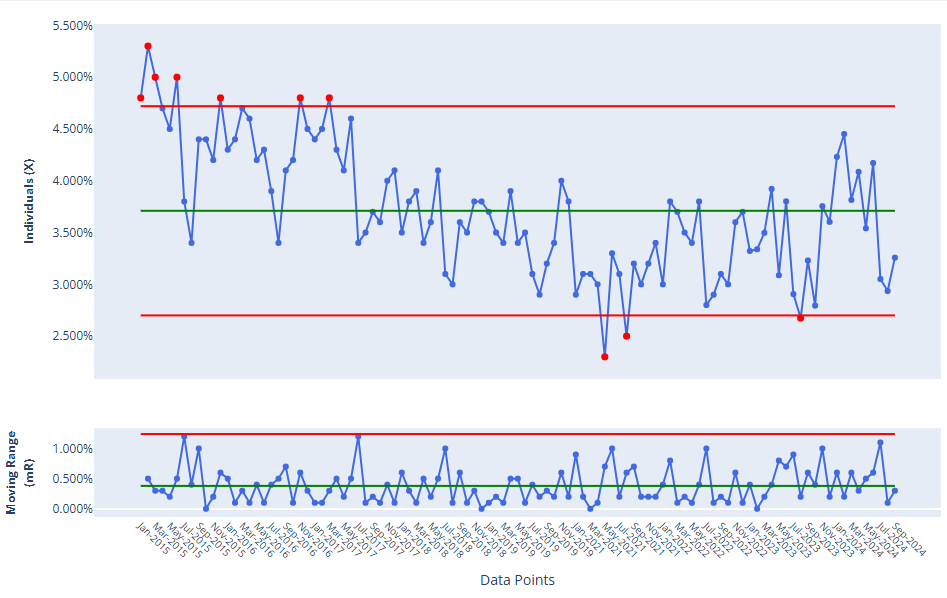

# Day 5: Lens Two—Knowledge of Variation

## "Fate, It Seems, Is Not Without a Sense of Irony"

In the Matrix, The Oracle tells Neo about fate and choice. She's describing something Neo will understand later: the difference between the predetermined and the genuinely new—between pattern and signal.

This is exactly what **knowledge of variation** helps us understand: how and when to make choices to intervene in a system by distinguishing signals from noise in the data it produces.

Dr. Deming tells us:
> ***Life is variation.*** *Variation there will always be, between people, in output, in service, in product. What is the variation tion trying to tell us about a process, and about the people ple that work in it'?*
>
> W. Edwards Deming. *The New Economics for Industry, Government, Education* (2nd Ed, pp. , 3rd Ed, pp. ) 

**Everything varies. Every process, every outcome, every measurement.**

The question isn't "Did variation occur?" (it always does). The question is: **"What kind of variation is this?"**

### Two Types of Variation:

**1. Common Cause Variation (The System's Normal Behaviour)**
- Inherent in the process
- Predictable in aggregate, random in detail
- Always present
- Cannot be attributed to specific causes
- **Examples:** Slight differences in commute time, small variations in product dimensions, normal fluctuations in sales

**2. Special Cause Variation (A Signal of Extraordinary Behaviour)**
- Operational definition for management action
- Can come from outside the system due to specific, identifiable causes
- Can come from within the system due to changes in a process, material, personnel, training
- **Examples:** Machine breakdown, supplier change, new competitor, weather event, change in how a KPI is monitored or calculated

**Why this matters:**

The most common management mistake is **tampering**—treating common cause variation as if it were special cause. This makes performance worse, not better.

**Examples of tampering:**
- An employee has a slow week, so their manager "coaches" them (it was random variation, now they're demoralized)
- Monthly sales dip, so leadership demands an explanation (no special cause—just variation)
- One customer complaint triggers a process change (was it signal or noise?)
- Bonuses for above-average performance (rewarding luck, punishing the unlucky)

**The opposite mistake—also common:**
Ignoring special causes because "everything varies" and missing genuine signals that need response.

**How to tell the difference:**

You need a **control chart**—a basic statistical tool showing:
- The process average (centerline)
- Normal variation boundaries (control limits)
- Whether points fall outside these limits or show patterns

**The profound insight:** Once you understand variation, you realize that most of what managers "react to" is just the system talking to itself. **Most management action is tampering.**

The wise manager:
- Lets common cause variation alone (stable but imperfect is normal)
- Investigates special causes (something changed)
- Works to reduce common cause variation by improving the system (not reacting to individual points)

## Process Behaviour Charts

A contemporary of Dr. Deming's, Dr. Donald Wheeler, popularized the use of special charts to visualize variation in a data set called a **Process Behaviour Chart.** It looks like a standard run chart with some specific features: horizontal lines indicating the mean, upper process limit, and lower process limit. These lines aren't arbitrary, but calculated from the data themselves. Data points that appear above or below respective process limit lines indicate signals.

## Reflection Questions
1. Think of the last time you or your leadership "reacted" to a number. Was it signal or noise?
2. What percentage of your management energy goes to reacting versus improving the system?

## Today's Challenge
Track something over time (response time, error rate, sales, anything). Plot it. Do you see a stable pattern with random variation, or do you see genuine signals of change?
